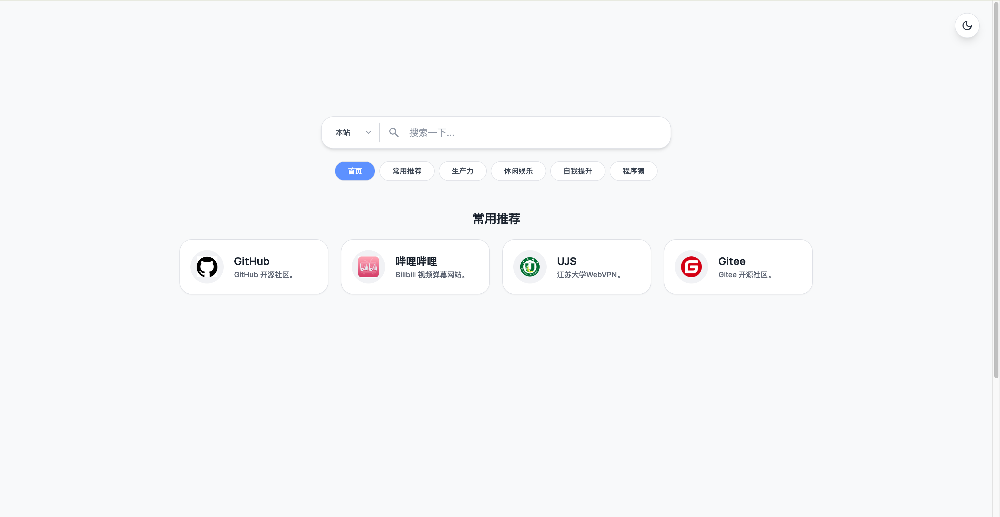
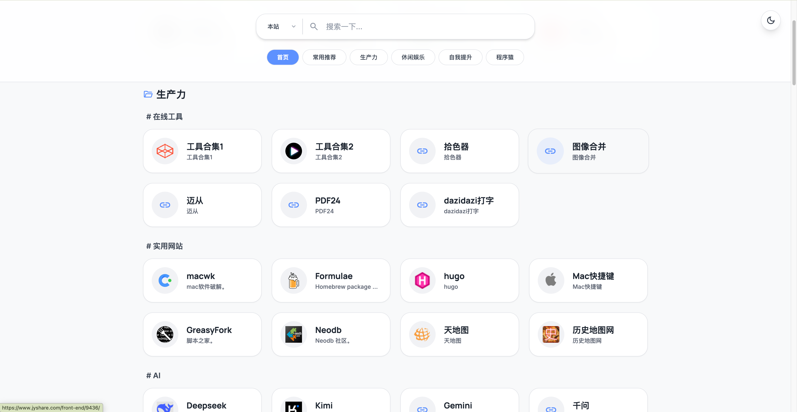
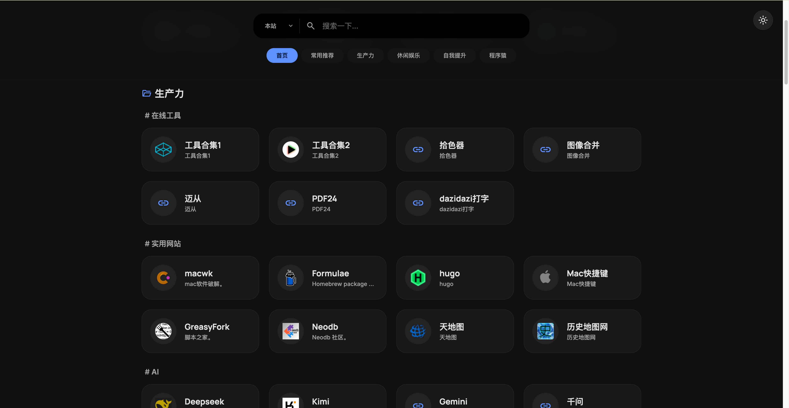
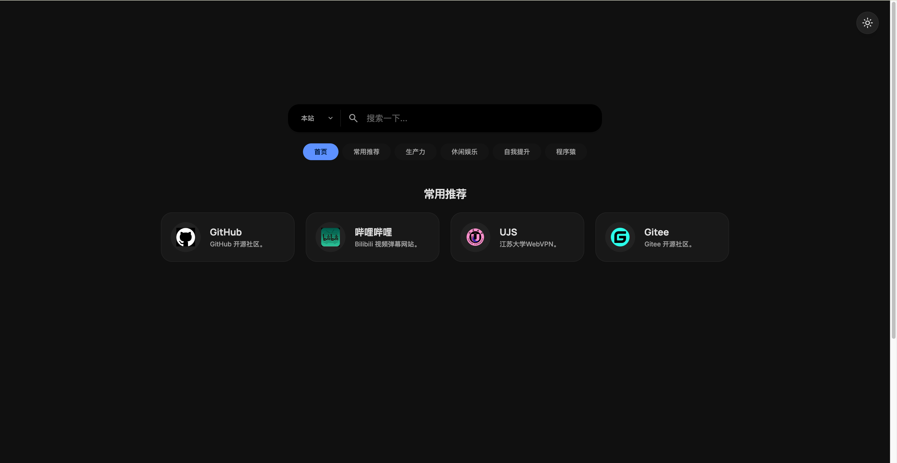
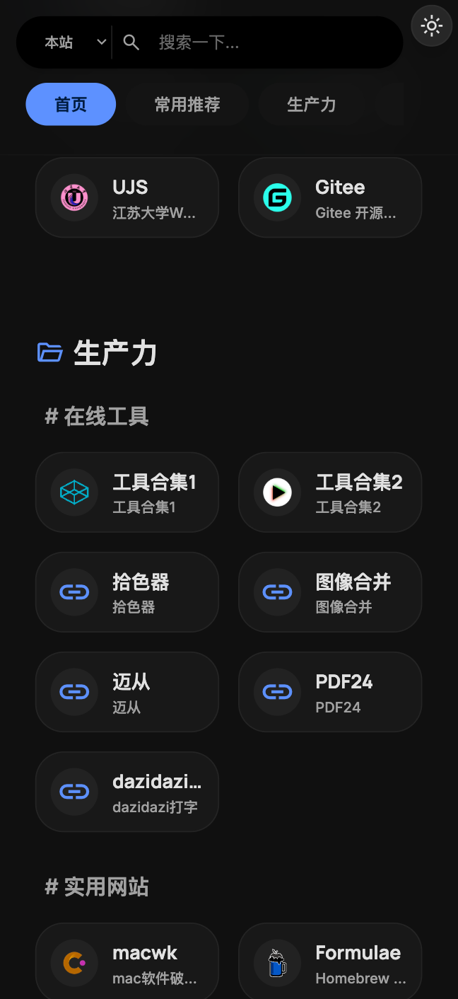
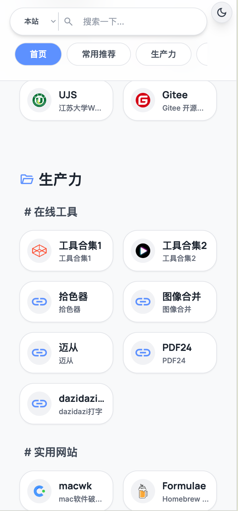

# My Webstack - 极简个人导航网站

一个基于纯静态文件 (HTML + TailwindCSS + JS) 构建的极简个人导航网站。数据由 YAML 文件驱动，支持多引擎搜索和站内快速过滤，无需数据库，**开箱即用，支持一键部署到 Vercel**。

## ✨ 特性

- 🚀 **纯静态架构**：无后端、无数据库，极致加载速度。
- 🎨 **现代化 UI**：使用 TailwindCSS 构建，支持深色/浅色主题自由切换。
- 🔍 **智能搜索**：
  - 支持下拉选择多个搜索引擎（Bing, Google, 百度）。
  - **本站搜索模式**支持多关键词实时过滤，快速定位你的专属书签。
- 📱 **完全响应式**：PC 端、平板、移动端均有优秀的吸顶导航和交互体验。
- ⚙️ **配置简单**：所有网站数据集中在一个 `config.yml` 文件中，维护成本极低。

## 📸 界面预览








## 🛠️ 如何使用与本地开发

1. **克隆项目到本地**
   ```bash
   git clone https://github.com/rxlxr11/myWebstack.git
   cd myWebstack
   ```

2. **配置你的导航数据**
   打开根目录下的 `config.yml` 文件，按照现有的 YAML 格式修改为你自己的分类和网站链接。
   ```yaml
   - taxonomy: 常用推荐
     links:
       - title: 网站名称
         url: https://example.com
         description: 网站的一句话描述
         logo: logo.png # 需将图片放入 static/logo/ 目录下
   ```

3. **本地预览**
   因为涉及加载本地的 `config.yml`，需要启动一个简单的本地 HTTP 服务（直接双击 index.html 可能会跨域报错）。
   如果你安装了 Python：
   ```bash
   python3 -m http.server 8080
   ```
   然后在浏览器打开 `http://localhost:8080` 即可预览。

## 🚀 一键部署到 Vercel

本项目已经配置好了 `vercel.json`，完美支持 Vercel 静态托管。

1. 登录你的 [Vercel 账号](https://vercel.com/)。
2. 点击 **Add New...** -> **Project**。
3. 导入（Import）你 fork 或 clone 到自己 GitHub 的这个 `myWebstack` 仓库。
4. **无需任何额外构建配置**，Framework Preset 保持默认的 `Other` 即可。
5. 点击 **Deploy**。
6. 几十秒后，你的专属个人导航网站就上线啦！🎉

### 📦 Vercel 配置文件说明
项目中的 `vercel.json` 已经帮你处理好了所有静态资源（HTML, JS, CSS, YAML, 以及 static 文件夹下的图片）的正确解析和路由分发，直接推送代码即可自动构建更新。

## 📝 目录结构

```text
├── index.html       # 网站主入口，包含骨架和 UI 结构
├── index.css        # 自定义 CSS 样式
├── index.js         # 核心逻辑：解析 YAML、渲染卡片、搜索逻辑、主题切换等
├── config.yml       # 核心数据：你所有的网址分类和链接都写在这里
├── vercel.json      # Vercel 部署配置文件
├── static/          # 静态资源目录
│   └── logo/        # 存放各个网站的图标 (推荐使用 png/svg)
└── imgs/            # 存放项目截图说明
```

## 🤝 贡献与定制

代码非常简单，所有逻辑都在 `index.js` 和 `index.html` 中。如果你熟悉基本的前端三剑客（HTML/CSS/JS），可以非常轻松地二次开发，比如：
- 修改 Tailwind 配置文件中的主题色（在 index.html 头部）。
- 增加新的搜索引擎选项。
- 调整卡片的网格布局。

欢迎 Fork 本项目打造属于你自己的导航页！
